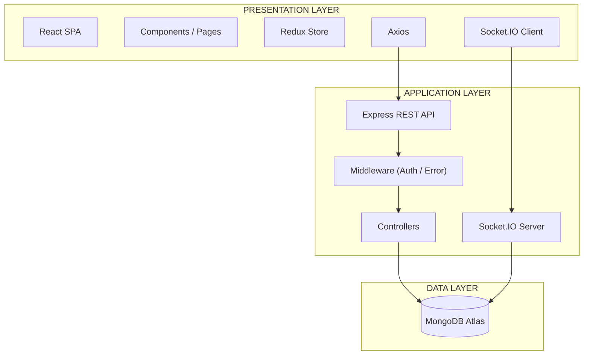
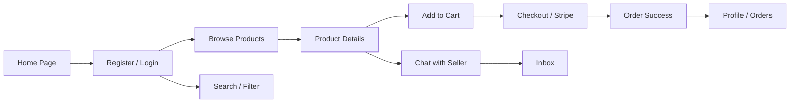
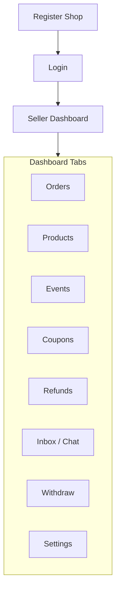
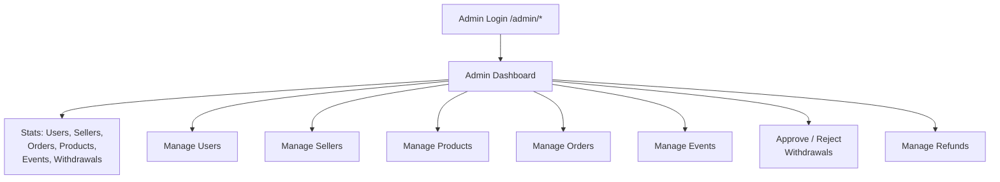
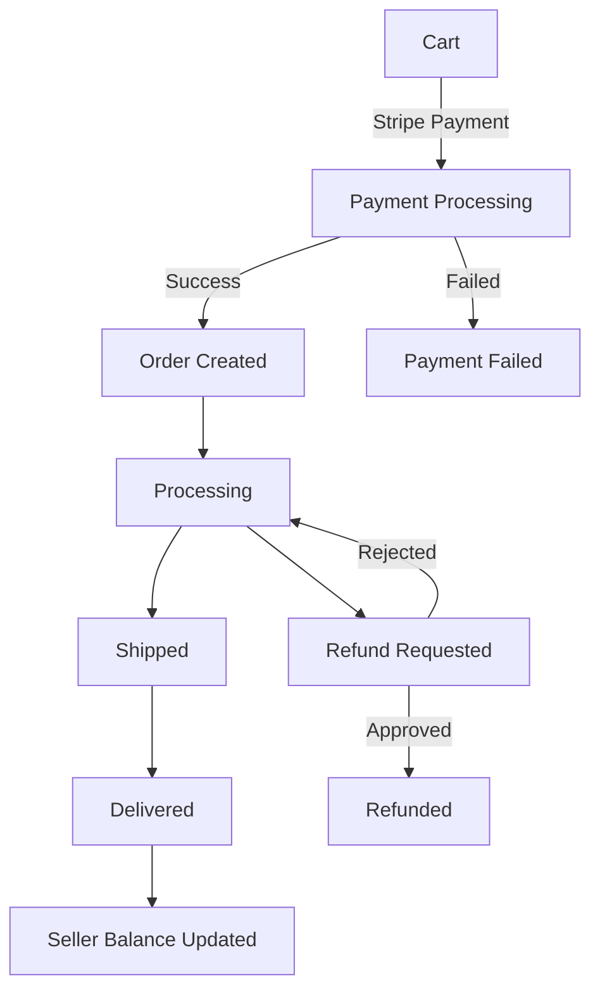
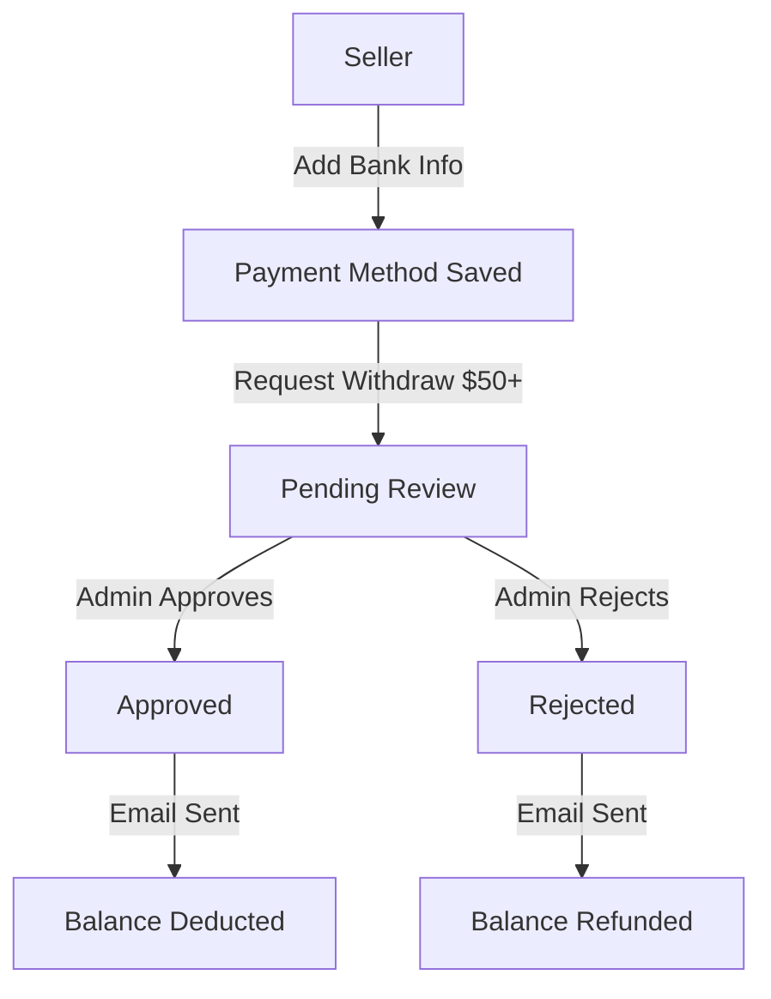
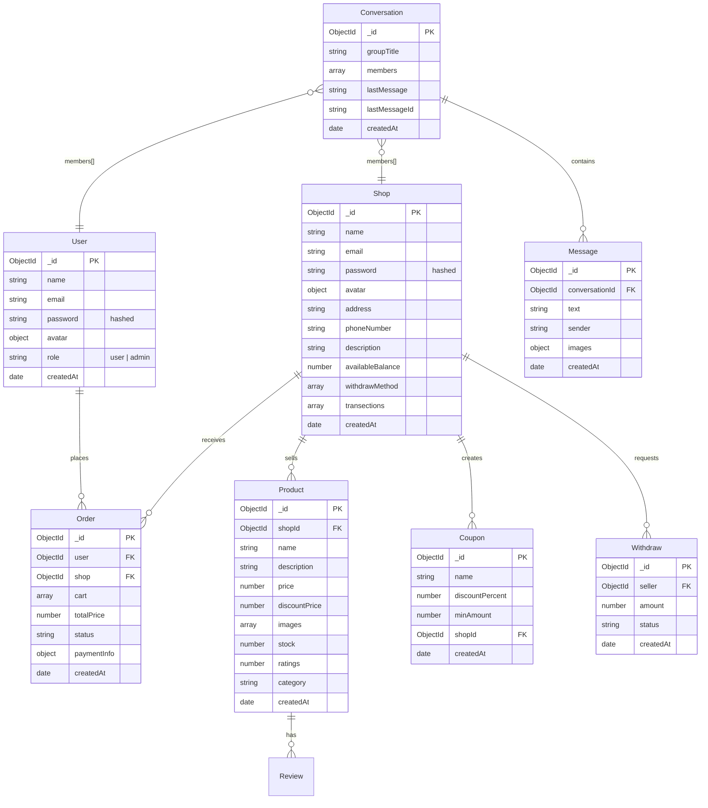
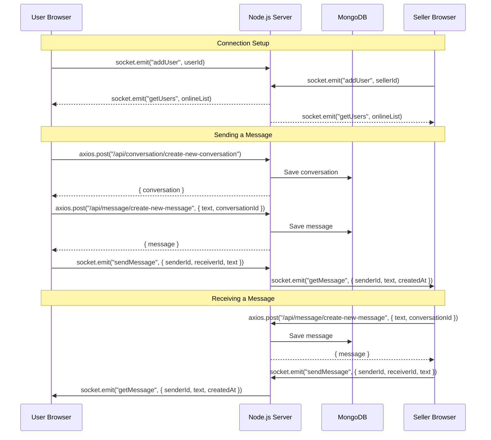
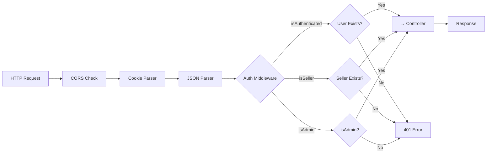
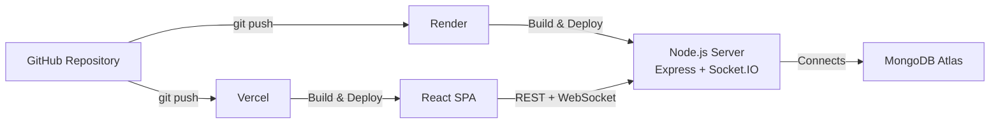

# Multi-Vendor E-Commerce Platform

A full-featured multi-vendor e-commerce platform built with the **MERN stack** (MongoDB, Express, React, Node.js). Buyers can browse products, checkout via Stripe, and chat with sellers in real time. Sellers get a full dashboard to manage products, orders, events, coupons, and withdrawals. An admin panel provides centralized oversight of users, sellers, products, orders, and withdrawal requests.

---

## Table of Contents

- [Tech Stack](#tech-stack)
- [System Architecture](#system-architecture)
- [Key Features](#key-features)
- [Application Flow](#application-flow)
  - [User Flow](#user-flow)
  - [Seller Flow](#seller-flow)
  - [Admin Flow](#admin-flow)
  - [Order Lifecycle Flow](#order-lifecycle-flow)
  - [Withdrawal Flow](#withdrawal-flow)
- [Database Design](#database-design)
- [API Architecture](#api-architecture)
- [Real-Time Chat](#real-time-chat)
- [Authentication & Security](#authentication--security)
- [Project Structure](#project-structure)
- [SOLID Principles Applied](#solid-principles-applied)
- [Deployment Pipeline](#deployment-pipeline)

---

## Tech Stack

### Backend

| Layer           | Technology                    |
| --------------- | ----------------------------- |
| Runtime         | Node.js (ESM)                 |
| Framework       | Express 5                     |
| Database        | MongoDB + Mongoose 9          |
| Auth            | JWT (jsonwebtoken)            |
| Payments        | Stripe                        |
| Email           | Nodemailer (Gmail SMTP)       |
| Real-Time       | Socket.IO                     |
| File Uploads    | Multer                        |
| Async Wrapper   | express-async-handler         |

### Frontend

| Layer             | Technology                      |
| ----------------- | ------------------------------- |
| Framework         | React 19 + TypeScript           |
| Build Tool        | Vite 8                          |
| Styling           | Tailwind CSS 4 + shadcn/ui      |
| State Management  | Redux Toolkit                   |
| Routing           | React Router v7                 |
| HTTP Client       | Axios                           |
| Real-Time         | socket.io-client                |
| UI Icons          | lucide-react, react-icons       |

### Deployment

| Service         | Hosts                               |
| --------------- | ----------------------------------- |
| Render          | Backend (Express + Socket.IO + API) |
| Vercel          | Frontend (React SPA)                |
| MongoDB Atlas   | Database                            |

---

## System Architecture



**Key design points:**
- Express and Socket.IO share the same HTTP server and port
- Socket.IO is NOT a separate service — it's mounted on the same Render instance
- Frontend talks to the backend via REST for CRUD and via WebSocket for real-time events

---

## Key Features

### Multi-Role User System

| Role     | Capabilities                                                           |
| -------- | ---------------------------------------------------------------------- |
| **Buyer**  | Browse products, add to cart, checkout (Stripe), place orders, write reviews, chat with sellers |
| **Seller** | Register shop, manage products/events/coupons, view orders, withdraw earnings, chat with buyers |
| **Admin**  | Dashboard with stats, manage users/sellers/products/orders/events, approve/reject withdrawals |

### Product Management & Shopping

- Product listings with images, pricing, discounts, ratings
- Category-based browsing, search, and filtering
- Shopping cart with quantity controls
- Checkout flow with Stripe payment integration
- Order history and tracking

### Seller Dashboard

- Sales analytics and statistics
- Order management (process, ship, deliver)
- Product CRUD (create, edit, delete)
- Event management (flash sales / campaigns)
- Coupon code generation
- Withdraw earnings (min $50)
- Refund request handling

### Admin Panel

- Centralized management of all entities
- User and seller account management
- Product and event moderation
- Order oversight
- Withdrawal approval/rejection workflow

### Real-Time Messaging

- Buyer ↔ Seller direct chat
- Online/offline presence indicators
- Image sharing in chat
- Real-time message delivery via WebSockets
- Persistent message history

---

## Application Flow

### User Flow



### Seller Flow



### Admin Flow



### Order Lifecycle Flow



### Withdrawal Flow



---

## Database Design



**Relationships:**
- `User` → `Order` (one-to-many)
- `Shop` → `Product`, `Order`, `Coupon`, `Withdraw` (one-to-many each)
- `Conversation` → `Message` (one-to-many)
- `Conversation.members[]` references both `User._id` and `Shop._id`

---

## API Architecture

All API routes are prefixed with `/api/`.

### Auth & Users

| Method   | Endpoint                                     | Auth    | Description              |
| -------- | -------------------------------------------- | ------- | ------------------------ |
| POST     | `/api/user/register`                         | -       | Register new user        |
| POST     | `/api/user/activation`                       | -       | Activate account via email |
| POST     | `/api/user/login`                            | -       | Login user               |
| GET      | `/api/user/logout`                           | -       | Logout (clear cookie)    |
| GET      | `/api/user/me`                               | User    | Get current user         |
| PUT      | `/api/user/update-profile`                   | User    | Update profile           |
| GET      | `/api/user/user-info/:id`                    | -       | Get user by ID (chat)    |
| GET      | `/api/user/admin-all-users`                  | Admin   | List all users           |
| DELETE   | `/api/user/admin-delete-user/:id`            | Admin   | Delete user              |

### Shop / Seller

| Method   | Endpoint                                     | Auth    | Description              |
| -------- | -------------------------------------------- | ------- | ------------------------ |
| POST     | `/api/shop/register`                         | -       | Register shop            |
| POST     | `/api/shop/login`                            | -       | Login seller             |
| GET      | `/api/shop/logout`                           | -       | Logout seller            |
| GET      | `/api/shop/me`                               | Seller  | Get current shop         |
| GET      | `/api/shop/get-shop-info/:id`                | -       | Get shop by ID (chat)    |
| PUT      | `/api/shop/update-shop`                      | Seller  | Update shop info         |
| PUT      | `/api/shop/update-payment-methods`           | Seller  | Update withdraw method   |
| DELETE   | `/api/shop/delete-withdraw-method`           | Seller  | Delete withdraw method   |
| GET      | `/api/shop/admin-all-sellers`                | Admin   | List all sellers         |
| DELETE   | `/api/shop/admin-delete-seller/:id`          | Admin   | Delete seller            |

### Products

| Method   | Endpoint                                     | Auth    | Description              |
| -------- | -------------------------------------------- | ------- | ------------------------ |
| POST     | `/api/product/create-product`                | Seller  | Create product           |
| GET      | `/api/product/all-products`                  | -       | Get all products         |
| GET      | `/api/product/shop/:id`                      | -       | Get shop's products      |
| DELETE   | `/api/product/delete-product/:id`            | Seller  | Delete product           |
| PUT      | `/api/product/create-new-review`             | User    | Add review               |

### Orders

| Method   | Endpoint                                     | Auth    | Description              |
| -------- | -------------------------------------------- | ------- | ------------------------ |
| POST     | `/api/order/create-order`                    | User    | Place order              |
| GET      | `/api/order/me`                              | User    | Get user's orders        |
| GET      | `/api/order/seller/:id`                      | Seller  | Get seller's orders      |
| GET      | `/api/order/admin-all-orders`                | Admin   | Get all orders           |
| PUT      | `/api/order/update-order-status/:id`         | Seller  | Update order status      |
| GET      | `/api/order/seller-refund-orders/:id`        | Seller  | Get refund requests      |
| PUT      | `/api/order/refund-order/:id`                | Seller  | Approve/reject refund    |

### Payments & Withdraw

| Method   | Endpoint                                     | Auth    | Description              |
| -------- | -------------------------------------------- | ------- | ------------------------ |
| POST     | `/api/payment/process`                       | User    | Process Stripe payment   |
| GET      | `/api/payment/stripepublishablekey`          | -       | Get Stripe public key    |
| POST     | `/api/withdraw/create-withdraw-request`      | Seller  | Request withdrawal       |
| GET      | `/api/withdraw/admin-all-withdraws`          | Admin   | Get all requests         |
| PUT      | `/api/withdraw/update-withdraw-status/:id`   | Admin   | Approve/reject           |

### Chat

| Method   | Endpoint                                     | Auth    | Description              |
| -------- | -------------------------------------------- | ------- | ------------------------ |
| POST     | `/api/conversation/create-new-conversation`  | -       | Create/get conversation  |
| GET      | `/api/conversation/get-all-conversation-seller/:id` | Seller | Seller's conversations   |
| GET      | `/api/conversation/get-all-conversation-user/:id` | User    | User's conversations     |
| PUT      | `/api/conversation/update-last-message/:id`  | -       | Update last message      |
| POST     | `/api/message/create-new-message`            | -       | Send message             |
| GET      | `/api/message/get-all-messages/:id`          | -       | Get conversation messages |

---

## Real-Time Chat

### Architecture



### Socket Events

| Event              | Direction         | Payload                                          | Description                    |
| ------------------ | ----------------- | ------------------------------------------------ | ------------------------------ |
| `addUser`          | Client → Server   | `{ userId }`                                     | Register user as online        |
| `getUsers`         | Server → All      | `[{ userId }]`                                   | Broadcast online user list     |
| `sendMessage`      | Client → Server   | `{ senderId, receiverId, text, images? }`        | Relay message to receiver      |
| `getMessage`       | Server → Receiver | `{ senderId, text, images?, createdAt }`         | Deliver message in real-time   |
| `updateLastMessage`| Client → Server   | `{ lastMessage, lastMessageId }`                  | Update conversation preview    |
| `disconnect`       | Client → Server   | —                                                | Remove from online users       |

### Data Persistence

Messages are **always saved to MongoDB** via REST API (`POST /api/message/create-new-message`) — the Socket.IO events are only for real-time delivery. On page load, all messages are fetched from the database.

---

## Authentication & Security



- **JWT-based auth** with separate secrets for users (`JWT_SECRET`) and sellers (`JWT_SECRET_KEY_2`)
- Tokens stored in **HTTP-only cookies** (`auth_token` for users, `shop_token` for sellers)
- Passwords hashed with **bcrypt** (pre-save hook)
- **Protected routes** on both frontend (`ProtectedRoute`, `SellerProtectedRoute`, `ProtectedAdminRoute`) and backend (`isAuthenticated`, `isSeller`, `isAdmin` middleware)
- `withCredentials: true` on all Axios requests for cookie transmission
- Admin middleware reads `auth_token` cookie directly — no dependency on `isAuthenticated`
- CORS restricted to frontend origin

---

## Project Structure

```
multivendor/
├── backend/
│   ├── config/
│   │   └── .env
│   ├── controllers/
│   │   ├── userController.js
│   │   ├── shopController.js
│   │   ├── productController.js
│   │   ├── eventController.js
│   │   ├── couponController.js
│   │   ├── orderController.js
│   │   ├── paymentController.js
│   │   ├── withdrawController.js
│   │   ├── conversationController.js
│   │   └── messageController.js
│   ├── db/
│   │   └── database.js
│   ├── middleware/
│   │   ├── authMiddleware.js
│   │   └── errorMiddleware.js
│   ├── models/
│   │   ├── userModel.js
│   │   ├── shopModel.js
│   │   ├── productModel.js
│   │   ├── eventModel.js
│   │   ├── couponModel.js
│   │   ├── orderModel.js
│   │   ├── withdrawModel.js
│   │   ├── conversationModel.js
│   │   └── messageModel.js
│   ├── socket/
│   │   └── socketServer.js
│   ├── utils/
│   │   ├── emailTemplates.js
│   │   ├── generateToken.js
│   │   └── sendMail.js
│   ├── app.js
│   └── server.js
├── frontend/
│   ├── public/
│   ├── src/
│   │   ├── components/
│   │   │   ├── Admin/
│   │   │   ├── Cart/
│   │   │   ├── Checkout/
│   │   │   ├── Home/
│   │   │   ├── Layout/
│   │   │   ├── Login/
│   │   │   ├── Payment/
│   │   │   ├── ProductCard/
│   │   │   ├── ProductDetails/
│   │   │   ├── Profile/
│   │   │   ├── Register/
│   │   │   ├── Shop/
│   │   │   ├── Wishlist/
│   │   │   └── ui/          (shadcn components)
│   │   ├── pages/           (37 page components)
│   │   ├── redux/
│   │   │   ├── actions/
│   │   │   ├── reducers/
│   │   │   └── store.js
│   │   ├── routes/
│   │   │   ├── Routes.ts
│   │   │   ├── shopRoutes.ts
│   │   │   ├── ProtectedRoute.tsx
│   │   │   ├── ProtectedAdminRoute.tsx
│   │   │   └── SellerProtectedRoute.tsx
│   │   ├── utils/
│   │   │   └── timeago.js
│   │   ├── App.css
│   │   ├── App.tsx
│   │   ├── server.js
│   │   └── styles.js
│   ├── .env
│   ├── package.json
│   └── vite.config.ts
├── package.json
└── README.md
```

---

## SOLID Principles Applied

| Principle | Implementation |
| --------- | -------------- |
| **S**ingle Responsibility | Each controller handles one domain (user, shop, product, order, etc.). Models are separated by entity. Middleware has a single job (auth, error handling, file upload). |
| **O**pen/Closed | Controllers extend behavior via new routes without modifying existing ones. Mongoose models can be extended with new fields/schemas without altering core logic. |
| **L**iskov Substitution | Auth middleware (`isAuthenticated`, `isSeller`, `isAdmin`) are interchangeable — any can be dropped before a route handler without breaking the request-response contract. |
| **I**nterface Segregation | Frontend API calls use granular endpoints (`/api/user/me`, `/api/shop/me`, `/api/order/me`) instead of a monolithic API client. Socket events are separate from REST routes. |
| **D**ependency Inversion | High-level route definitions depend on controller abstractions, not implementations. Mongoose models are injected into controllers via imports. `sendMail.js` wraps Nodemailer behind a simple async interface. |

---

## Deployment Pipeline



**Pipeline steps:**
- Push to GitHub triggers automatic builds on both Render and Vercel
- Render builds and runs the Express + Socket.IO backend
- Vercel builds and hosts the React SPA
- Backend connects to MongoDB Atlas for data persistence
- Frontend communicates with backend via REST API and WebSocket
